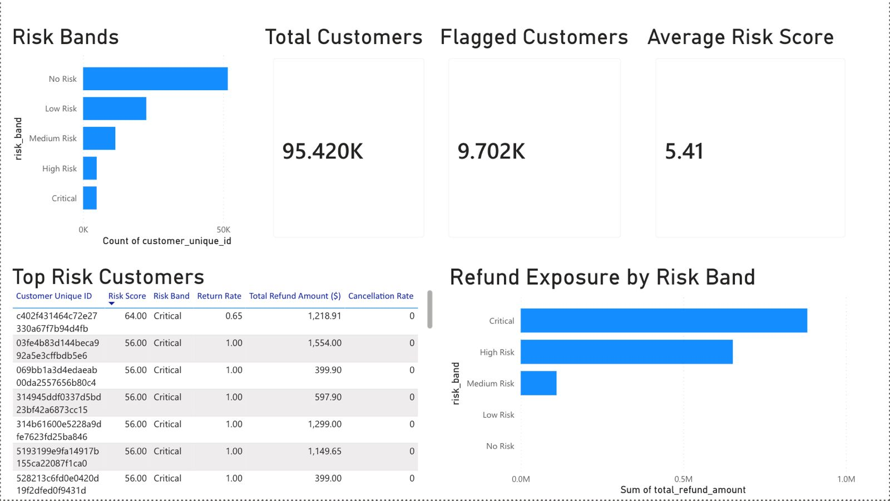
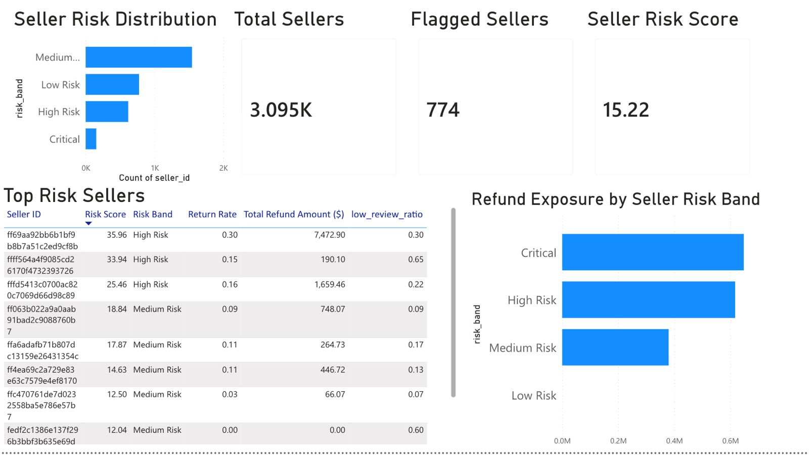
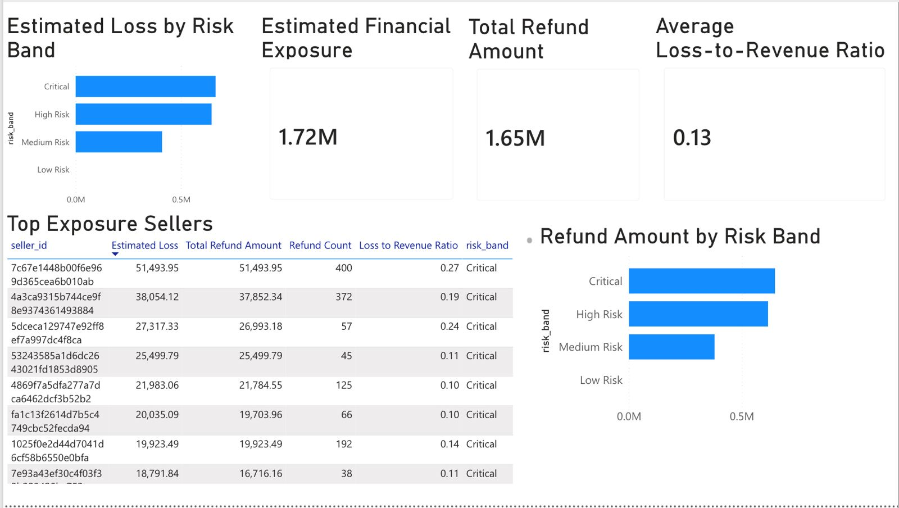

# E-Commerce Fraud & Risk Analytics

An end-to-end fraud detection and risk scoring pipeline built on the real Olist Brazilian e-commerce dataset, extended with domain-informed synthetic return and refund data, engineered into customer and seller risk scores using PostgreSQL, and visualized through a 3-page Power BI dashboard.

---

## Problem Statement

E-commerce platforms lose significant revenue through fraudulent returns, refund abuse, and poor-quality sellers. This project builds a data pipeline that tracks the full order lifecycle, identifies suspicious behavioral patterns, and assigns quantified risk scores to every customer and seller on the platform.

---

## Project Architecture


Olist Dataset (real)
        ↓
Feature Validation EDA (Python)
        ↓
Synthetic Event Generation (Python)
returns_table · refunds_table · cancellations_table
        ↓
PostgreSQL Database
Schema Design · PKs · FKs · Indexes
        ↓
SQL Feature Engineering
Customer Features · Seller Features
        ↓
Risk Scoring Engine (SQL)
Customer Risk Scores · Seller Risk Scores
        ↓
Analytical Views
vw_customer_fraud_monitoring
vw_seller_risk_monitoring
vw_financial_exposure
        ↓
Power BI Dashboard
3-page fraud monitoring dashboard


---

## Tech Stack

| Layer | Tool |
|---|---|
| Data generation & EDA | Python, Pandas, NumPy |
| Database loading | pgAdmin CSV Import |
| Database | PostgreSQL 16 |
| SQL client | pgAdmin 4 |
| Visualization | Power BI |

---

## Dataset

**Source:** [Olist Brazilian E-Commerce Public Dataset](https://www.kaggle.com/datasets/olistbr/brazilian-ecommerce)

Real transactional data from a Brazilian e-commerce marketplace containing 99,441 orders across 96,096 unique customers and 3,095 sellers.

**Olist does not contain return, refund, or fraud labels.** These were generated synthetically using a domain-informed probability model validated against real data distributions.

---

## Key Statistics

| Metric | Value |
|---|---|
| Total orders | 99,441 |
| Unique customers | 96,096 |
| Sellers | 3,095 |
| Order items | 112,650 |
| Synthetic returns generated | 12,474 |
| Synthetic refunds generated | 12,474 |
| Cancellation records | 1,234 |
| Total refund value | $1,645,057.99 |
| Estimated total exposure | $1,719,174.09 |
| Flagged customers | 9,702 (10.2%) |
| Flagged sellers | 774 (25.0%) |

---

## Synthetic Data Generation

Olist lacks return and refund records. A probability-based generator was built to create realistic synthetic events using features validated through EDA.

### Features Used to Drive Return Probability

| Feature | Importance | Justification |
|---|---|---|
| Review score | Very High | Primary dissatisfaction signal |
| Delivery delay | High | Directly correlates with return intent |
| Seller quality | Medium | Poor sellers generate more returns |
| Item price | Medium | Higher value items face more scrutiny |
| Product category | Low | Small baseline modifier only |
| Freight value | Excluded | Correlation with review score: r = -0.036 |

### Return Probability Model


Base probability: 0.08

review_score = 1  → +0.35
review_score = 2  → +0.18
delay > 14 days   → +0.15
price > 280       → +0.08
seller_quality < 2.5 → +0.10
category_avg < 3.9   → +0.04

Final = clip(raw, 0.01, 0.95)


**Target return rate:** ~10% | **Achieved:** 11.3%

### Return Reason Assignment

Reasons are assigned using weighted random selection conditioned on signals present:

| Review Score | Eligible Reasons |
|---|---|
| 1–2 stars | Defective, Not as Described, Quality Issue, Late Delivery, Wrong Item |
| 3–4 stars | All reasons with balanced weights |
| 5 stars | Changed Mind, Wrong Item only |
| Missing | Changed Mind, Quality Issue, Not as Described (neutral distribution) |

---

## Database Schema

10 tables loaded into PostgreSQL with full primary key, foreign key, and constraint definitions.

**Core Olist tables:** customers, orders, order_items, payments, products, sellers, reviews_dedup

**Synthetic tables:** returns_table, refunds_table, cancellations_table

> Geolocation and category translation tables were excluded as they do not contribute to fraud feature engineering.

---

## Feature Engineering

Six feature groups were built per entity (customer and seller) using SQL CTEs, window functions, and aggregations.

### Customer Features

| Feature Group | Key Metrics |
|---|---|
| Purchase behavior | total_orders, total_spend, avg_order_value, purchased_items |
| Return behavior | returned_items, return_rate |
| Refund behavior | refund_count, total_refund_amount, avg_refund_ratio |
| Cancellation behavior | cancellation_count, cancellation_rate |
| Review behavior | avg_review_score, low_review_ratio |
| Delivery behavior | avg_delivery_delay, late_order_ratio |

### Seller Features

Same structure as customer features with seller-specific adjustments — cancellation component excludes customer-initiated and payment failure events, focusing only on seller_issue and logistics_issue cancellations.

---

## Risk Scoring

### Customer Risk Score

```
risk_score = (
  0.30 × return_component
+ 0.30 × refund_component
+ 0.20 × cancellation_component
+ 0.10 × review_component
+ 0.10 × delivery_component
) × 100
```

Each component is min-max normalized (0–1). Outlier capping applied at P99 for total_refund_amount (cap: 329.84) and max_delivery_delay (cap: 19 days) before normalization.

**Customer Risk Bands (percentile-based):**

| Band | Score Range | Customers |
|---|---|---|
| No Risk | 0 | 51,625 (54.1%) |
| Low Risk | 0.01–1.5 | 22,569 (23.6%) |
| Medium Risk | 1.5–25 | 11,524 (12.1%) |
| High Risk | 25–36 | 4,870 (5.1%) |
| Critical | 36–64 | 4,832 (5.1%) |

### Seller Risk Score

```
risk_score = (
  0.35 × return_component
+ 0.25 × refund_component
+ 0.20 × review_component
+ 0.10 × cancellation_component
+ 0.10 × delivery_component
) × 100
```

**Seller Risk Bands (percentile-based):**

| Band | Score Range | Sellers |
|---|---|---|
| Low Risk | ≤ 2.39 | — |
| Medium Risk | 2.39–22.44 | — |
| High Risk | 22.44–36.23 | — |
| Critical | > 36.23 | — |

> Review component weighted higher for sellers (20%) than customers (10%) because seller reviews directly reflect product and service quality, making them a primary business signal rather than supporting evidence.

---

## Analytical Views

Three SQL views serve as the Power BI data layer:

| View | Purpose |
|---|---|
| vw_customer_fraud_monitoring | One row per customer with risk score, components, and behavioral metrics |
| vw_seller_risk_monitoring | One row per seller with risk score, components, and performance metrics |
| vw_financial_exposure | Seller-level estimated financial exposure combining refund losses and cancellation revenue loss |

**Estimated exposure formula:**
```
estimated_loss = total_refund_amount + (cancellation_count × avg_item_price)
```
> Labelled "Estimated Financial Exposure" not "Actual Loss" — cancellation losses are approximated, not confirmed transaction records.

---

## Power BI Dashboard

3-page fraud monitoring dashboard connected directly to PostgreSQL via analytical views.

### Page 1 — Customer Fraud Monitoring
- Risk band distribution
- Total customers, flagged customers, average risk score
- Top 10 highest-risk customers table
- Refund exposure by risk band


### Page 2 — Seller Risk Monitoring
- Seller risk band distribution
- Total sellers, flagged sellers, average seller risk score
- Top 10 highest-risk sellers table
- Refund exposure by seller risk band

### Page 3 — Financial Exposure Analysis
- Estimated financial exposure, total refund amount, loss-to-revenue ratio
- Estimated loss by risk band
- Top exposure sellers table
- Refund amount by risk band




---

## Business Value

This project demonstrates how an e-commerce platform can:
- Identify high-risk customers likely to generate excessive returns and refunds
- Monitor seller performance using behavioral and operational signals
- Quantify financial exposure caused by returns, refunds, and cancellations
- Prioritize investigation efforts using risk-based segmentation

---

## Key Findings

- **10.2% of customers** (9,702) flagged as High Risk or Critical — 10.2% of customers were classified as High Risk or Critical based on the scoring framework
- **Critical and High Risk customers** account for the majority of platform refund exposure despite representing only 10% of the customer base
- **25% of sellers** (774) flagged, with Critical sellers generating disproportionate financial losses
- **Estimated total platform exposure** of $1.72M across 3,095 sellers
- **Average loss-to-revenue ratio of 0.13** — meaning 13 cents of every revenue dollar is at risk from returns and cancellations

---

## Known Limitations

**Small seller sample bias:** 55.4% of sellers have fewer than 10 sales, which can inflate return rates for low-volume sellers. A production system would apply minimum transaction thresholds before scoring.

**Seller review reliability:** Review metrics may be unreliable for sellers with very few reviews. Bayesian smoothing would be applied in a production system to stabilize these estimates.

**Synthetic data:** Returns, refunds, and cancellations are synthetically generated. While grounded in real data distributions and domain logic, they do not represent actual return events.

**Estimated exposure:** Cancellation losses are approximated using average item price and may not reflect actual refund amounts for cancelled orders.

---

## Repository Structure


ecommerce-fraud-and-risk-analytics/
│
├── notebooks/
│   ├── 01_feature_validation_eda.ipynb
│   └── 02_synthetic_event_generation.ipynb
│
├── sql/
│   ├── schema.sql
│   └── views.sql
│
├── dashboard/
│   ├── page1_customer_fraud_monitoring.png
│   ├── page2_seller_risk_monitoring.png
│   └── page3_financial_exposure.png
│
└── README.md


---

## How to Run

1. Clone the repository
2. Download the Olist dataset from [Kaggle](https://www.kaggle.com/datasets/olistbr/brazilian-ecommerce)
3. Run `01_feature_validation_eda.ipynb` to validate features
4. Run `02_synthetic_event_generation.ipynb` to generate synthetic tables
5. Create a PostgreSQL database and run `sql/schema.sql` to build the schema
6. Load CSVs into PostgreSQL using SQLAlchemy or pgAdmin import
7. Run `sql/views.sql` to create analytical views
8. Connect Power BI to PostgreSQL and open the dashboard

---

